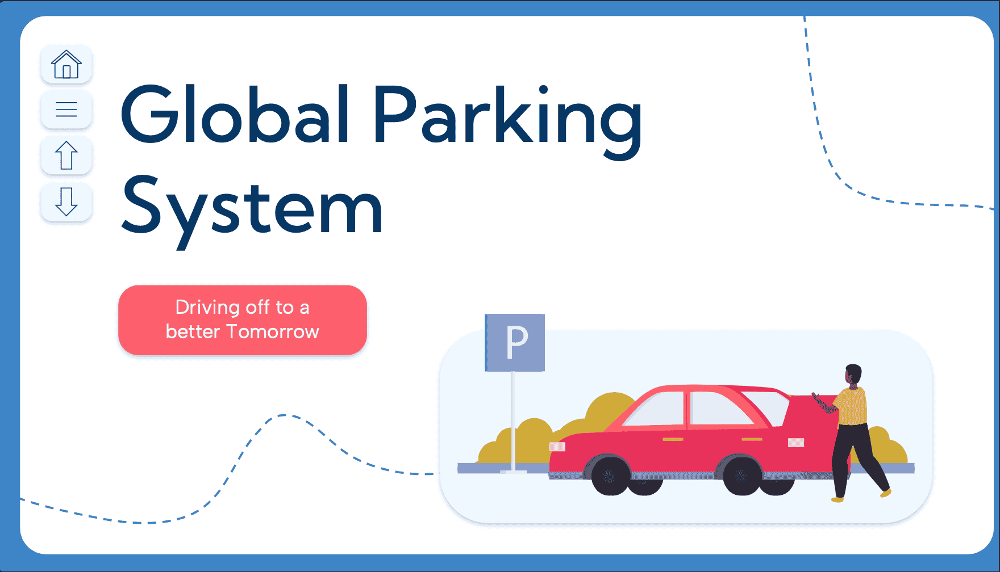
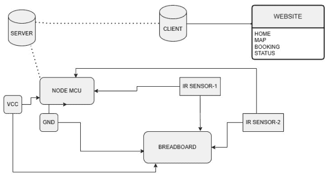
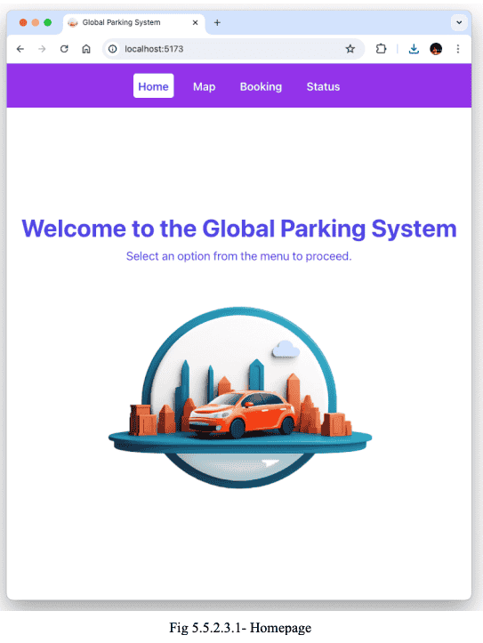
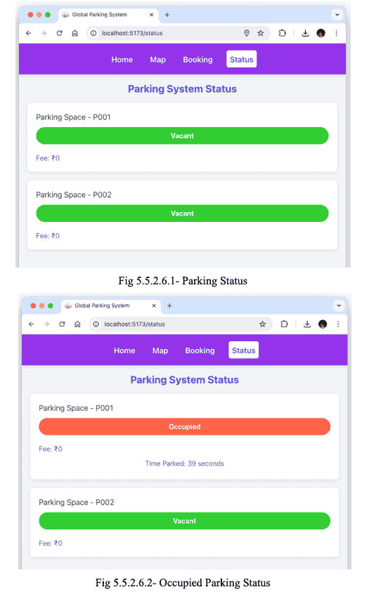
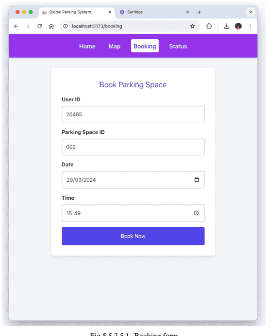
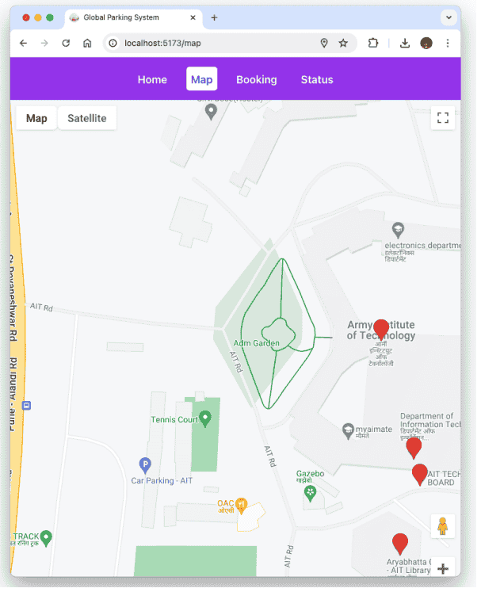
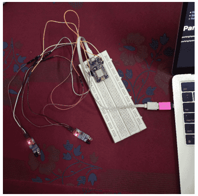

# Global Parking System Using IoT

## The Challenge
In today's urban areas, finding parking has become a significant challenge. Vehicle Owners waste considerable time searching for spots, leading to:
- Traffic congestion
- Increased fuel consumption
- Higher stress levels
- Environmental pollution
- Inefficient use of parking spaces

## The Solution
We developed a Smart Parking System using IoT technology that offers real-time parking space management. The system combines hardware sensors with a user-friendly web interface to create a seamless parking experience.

### Key Features
1. **Real-time Monitoring**
    - IR sensors detect vehicle presence in parking spots
    - Instant updates on parking space availability
    - Live occupancy tracking

2. **User-friendly Interface**
    - Interactive map showing parking locations
    - Online booking system
    - QR code-based entry and exit
    - Digital payment processing

3. **Smart Management**
    - Automated fee calculation based on parking duration
    - Real-time updates through MQTT protocol
    - Efficient space utilization
    - Seamless integration between hardware and software

### How It Works
1. **Finding a Spot**: Users can check available parking spaces in real-time through the web interface
2. **Booking**: Select a spot and book it through the online system
3. **Entry**: Scan the QR code received during booking to enter
4. **Parking**: IR sensors monitor vehicle presence and track duration
5. **Payment**: Automated fee calculation (₹10 per hour)
6. **Exit**: Generate exit QR code after payment completion

#### Project Diagram

### System Interface

### Key Features

1. **Real-time Monitoring**
   - IR sensors detect vehicle presence in parking spots
   - Instant updates on parking space availability
   - Live occupancy tracking

2. **User-friendly Booking System**
   - Interactive map showing parking locations
   - Online booking system
   - QR code-based entry and exit
   - Digital payment processing

3. **Location Services**

4. **Payment Processing**

## Real-World Implementation

## Benefits
- Reduces time spent searching for parking
- Decreases traffic congestion
- Lowers fuel consumption and emissions
- Improves overall parking efficiency
- Provides a stress-free parking experience

## Future Enhancements
- Integration with smart city infrastructure
- Personalized user preferences and loyalty programs
- Additional revenue streams through premium parking options
- Adaptation for various settings (airports, malls, residential areas)

This smart parking solution demonstrates how IoT technology can be effectively used to solve real-world urban challenges while providing a convenient experience for users.

---